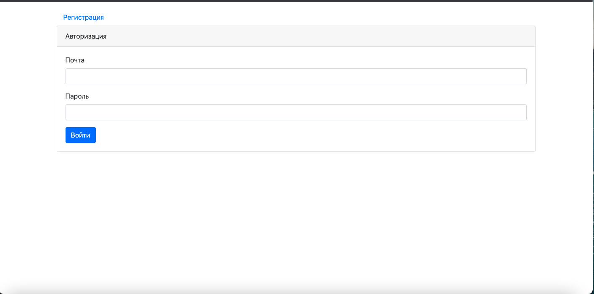
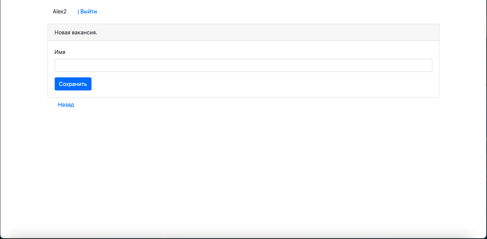

Проект "Работа мечты"

В блоке servlet мы будем разрабатывать приложение биржу работы.

В системе будут два типа пользователей: кандидаты и кадровики. Кандидаты будут публиковать резюме. Кадровики будут публиковать вакансии о работе.

Кандидаты могут откликнуться на вакансию. Кадровик может пригласить на вакансию кандидата.

